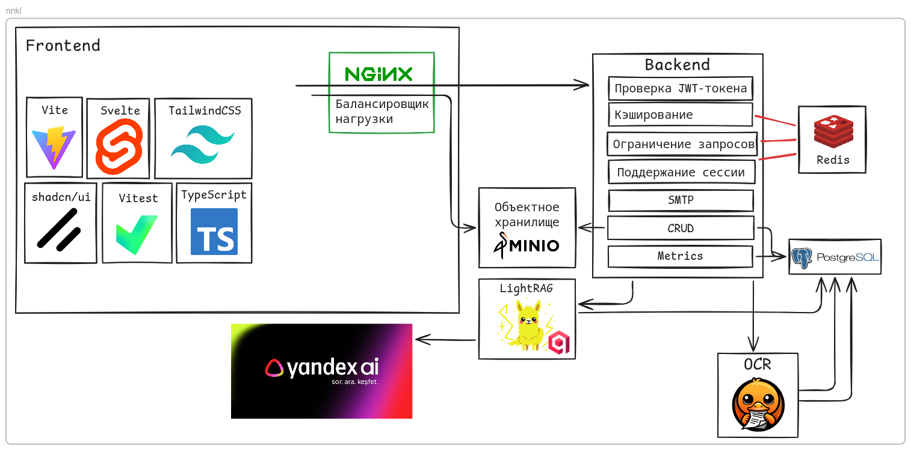
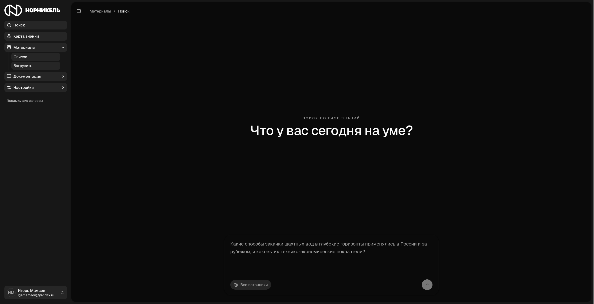
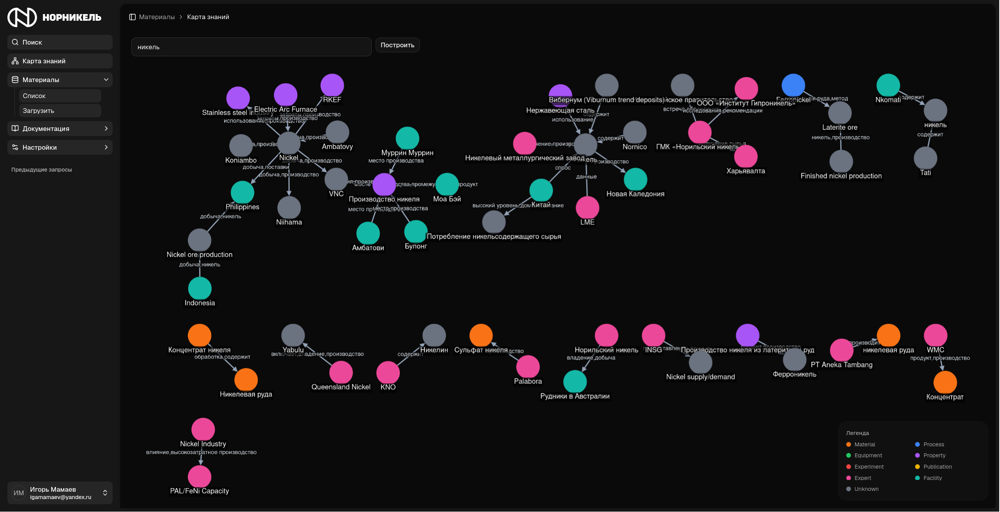
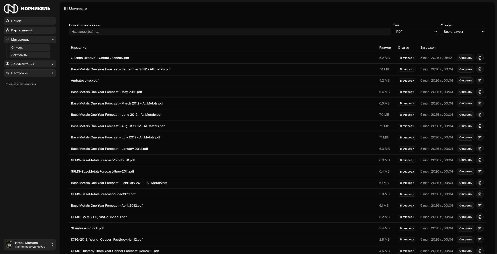

# Норникель — Карта знаний R&D

Единая карта знаний для горно-металлургических исследований и разработок. Система объединяет научные публикации, внутренние отчёты, экспериментальные данные и экспертизу в интерактивный граф знаний с возможностью семантического поиска.

## Проблема

В R&D горно-металлургической отрасли знания разрознены: отчёты, презентации, протоколы опытов и личные архивы хранятся в разных местах. Это приводит к:

- потере институциональной памяти;
- дублированию литературных обзоров и исследований;
- сложности междисциплинарного поиска;
- медленному принятию решений;
- риску противоречивых выводов.

## Решение

Платформа строит граф знаний из загруженных документов и позволяет:

- загружать PDF, DOCX, PPTX и ZIP-архивы;
- извлекать из документов сущности, связи и числовые параметры;
- задавать вопросы на естественном языке;
- визуализировать подграфы по темам;
- фильтровать результаты по типам сущностей, географии и источникам.

## Демо

> **TODO:** заменить на GIF-демо работы проекта (загрузка документа → вопрос → ответ с источниками → граф знаний).
>
> ```markdown
> 
> ```

## Архитектура

> **TODO:** заменить на схему архитектуры в виде изображения.
>
> ```markdown
> 
> ```

Текстовая схема:

```text
┌─────────────┐      ┌─────────────┐      ┌─────────────────┐
│   Nginx     │──────▶   Frontend  │──────▶     Backend     │
│  :9689      │      │  Svelte 5   │      │      Go         │
└─────────────┘      └─────────────┘      └─────────────────┘
                                                   │
                           ┌───────────────────────┼───────────────┐
                           ▼                       ▼               ▼
                    ┌─────────────┐        ┌─────────────┐  ┌─────────────┐
                    │  PostgreSQL │        │  LightRAG   │  │    OCR      │
                    │  (данные)   │        │  (граф/RAG) │  │  (MinerU)   │
                    └─────────────┘        └─────────────┘  └─────────────┘
```

LLM и embeddings вызываются через внешние API (Yandex AI Studio). GPU не требуется.

## Стек технологий

- **Backend**: Go, Gin, GORM, PostgreSQL
- **Frontend**: Svelte 5, Tailwind CSS, shadcn-svelte, Cytoscape
- **RAG / Graph**: LightRAG (PGGraphStorage)
- **OCR**: MinerU, Yandex Vision
- **Инфраструктура**: Docker, Docker Compose, Nginx

## Быстрый старт

1. Скопируйте `.env` из шаблона:

```bash
cp .env.example .env
```

2. Заполните обязательные ключи:

- `LIGHTRAG_LLM_BINDING_API_KEY` — API-ключ Yandex AI Studio;
- `LIGHTRAG_EMBEDDING_BINDING_API_KEY` — тот же или другой ключ Yandex AI Studio;
- `YANDEX_VISION_API_KEY` и `YANDEX_FOLDER_ID` — для OCR через Yandex Vision.

3. Запустите все сервисы:

```bash
docker compose up --build
```

4. Откройте приложение:

- Основной интерфейс: <http://localhost:9689>
- LightRAG Web UI: <http://localhost:19621>

## Локальная разработка

### Backend

```bash
cd backend
go run .
```

Требуется запущенный PostgreSQL и LightRAG (можно поднять через Docker Compose).

### Frontend

```bash
cd frontend
pnpm install
pnpm run dev
```

Фронтенд поднимется на <http://localhost:5173>.

## Структура проекта

```text
.
├── backend/          # Go-бэкенд, API, бизнес-логика
├── frontend/         # Svelte 5 приложение
├── lightrag/         # Конфигурация и документы LightRAG
├── ocr/              # Сервис OCR на базе MinerU
├── nginx/            # Конфигурация reverse proxy
├── postgres/         # Docker-образ PostgreSQL с AGE
├── docs/             # OpenAPI спецификация (apiv1.yaml)
└── docker-compose.yml
```

## Скриншоты интерфейса

> **TODO:** заменить на реальные скриншоты после финальной стилизации.
>
> ```markdown
> 
> 
> 
> ```

## Ключевые возможности

### Загрузка документов

Поддерживаются PDF, DOCX, PPTX и ZIP-архивы. После загрузки документы:

1. сохраняются в PostgreSQL;
2. отправляются в OCR-сервис для извлечения текста;
3. индексируются в LightRAG;
4. становятся доступны для поиска и графа.

### Поиск по базе знаний

По адресу `/data/ask` можно задать вопрос на естественном языке. Поддерживаются режимы:

- `hybrid` — граф + векторный поиск;
- `local` — только отечественные источники;
- `global`, `naive`, `mix` — режимы LightRAG.

### Карта знаний

По адресу `/data/graph` можно построить интерактивный подграф по теме. Ноды раскрашиваются по типам:

- Material — материалы и вещества
- Process — процессы и методы
- Equipment — оборудование
- Property — параметры и свойства
- Experiment — эксперименты и исследования
- Publication — публикации и отчёты
- Expert — эксперты и организации
- Facility — объекты и локации

### Мои материалы

Страница `/data` показывает загруженные документы с фильтрами по названию, типу файла и тегам.

## API

Спецификация API находится в [`docs/apiv1.yaml`](docs/apiv1.yaml). Основные группы endpoints:

- `POST /api/v1/auth/register` — регистрация
- `POST /api/v1/auth/login` — вход
- `GET  /api/v1/auth/me` — текущий пользователь
- `GET  /api/v1/data` — список документов
- `POST /api/v1/data` — загрузка файлов
- `POST /api/v1/data/ask` — вопрос к базе знаний
- `POST /api/v1/data/ask/stream` — стриминговый ответ
- `POST /api/v1/data/graph` — подграф по запросу
- `GET  /api/health` — проверка здоровья системы

## Тестирование

### Backend

```bash
cd backend
go test ./...
```

### Frontend

```bash
cd frontend
pnpm run check
pnpm run lint
pnpm run build
```

## Переменные окружения

Основные переменные:

| Переменная | Описание |
|---|---|
| `LIGHTRAG_LLM_BINDING_API_KEY` | Ключ LLM-провайдера |
| `LIGHTRAG_EMBEDDING_BINDING_API_KEY` | Ключ embedding-провайдера |
| `YANDEX_VISION_API_KEY` | Ключ Yandex Vision OCR |
| `YANDEX_FOLDER_ID` | Folder ID Yandex Cloud |
| `POSTGRES_*` | Параметры подключения к БД |
| `MAX_UPLOAD_SIZE_MB` | Лимит загрузки файлов |
| `AUTH_SECRET` | Секрет для JWT |

Полный список см. в `.env.example`.

## Статус и дорожная карта

Реализовано:

- [x] Авторизация и управление сессиями
- [x] Загрузка и хранение документов
- [x] OCR и индексация в LightRAG
- [x] Семантический поиск и стриминг ответов
- [x] Интерактивная визуализация графа
- [x] Маппинг типов сущностей на легенду

В планах:

- [ ] Доменные типы сущностей в LightRAG
- [ ] Числовые фильтры и диапазоны
- [ ] Версионирование фактов и верификация
- [ ] Экспорт отчётов (PDF, Markdown)
- [ ] Дашборды для руководителей
- [ ] Ручная корректировка графа экспертами

## Лицензия

Проект разработан в рамках кейса для Норникеля.
